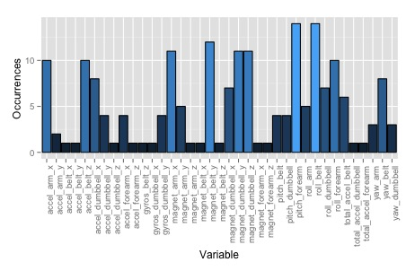
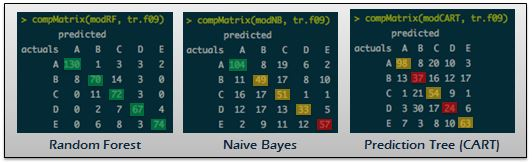
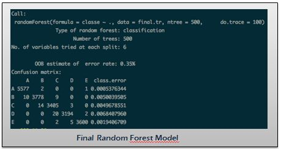

### *Executive Summary*

*The following document describes the model built to predict if a the Weight Lifting  Exercise (from now on WLE) was performed correctly. The analysis uses data made available by the Groupware-LES. The methodology involves practical machine learning techniques implemented in R, as learned in the Practical Machine Learning - JHU Coursera course. The model developed shows considerable prediction accuracy, with an OOB of %0.35.*  


```{r initialize, cache=TRUE, echo=FALSE, message=FALSE}
library(ggplot2)
library(caret)
library(randomForest)
library(rattle)

setwd('/Users/Will/Documents/Coursera/Data Science - JHU/Courses/8. Practical Machine Learning/Course Project')
# setwd("C:/Users/guillermo.monge.del1/Google Drive/Programming/R/8. Practical Machine Learning/Course Project/")
```


### 1. Data Processing

Data was obtained from the [Groupware - HAR (Human Activity Recognition) project][1] database.  

[1]: http://groupware.les.inf.puc-rio.br/har "link"

```{r download.data, cache=TRUE, echo=FALSE}
# data.date <- format(Sys.Date(), "%a %b %d %Y")
# tr.link <- "https://d396qusza40orc.cloudfront.net/predmachlearn/pml-training.csv"
# ts.link <- "https://d396qusza40orc.cloudfront.net/predmachlearn/pml-testing.csv"
# download.file(url=tr.link, destfile="data/pml-training.csv", method="curl")
# download.file(url=ts.link, destfile="data/pml-testing.csv", method="curl")
```

Raw data are two .csv files containing the training and test dataset.

Data was downloaded and loaded into an R data.frame object.
```{r read.train, cache=TRUE}
train.raw <- read.csv("data/pml-training.csv")
```

The training data contains 19.622 rows and 160 variables. The variables includes extensive on-body measurements from different accelerometers on the belt, forearm and dumbbell of six different participants, which were asked to perform barbell lifts correctly and incorrectly in 5 different ways.  

The variable to predict named *classe* and classifies each observation (barbell lift) into one of five categories which correspond to the different lift forms:  

**A** - exactly according to the specification  
**B** - throwing the elbows to the front  
**C** - lifting the dumbbell only halfway  
**D** - lowering the dumbbell only halfway  
**E** - throwing the hips to the front  

#### Missings
A quick check of the complete cases of the data set proves the existence of a high number of missings.  

```{r NA1, cache=TRUE}
sum(!complete.cases(train.raw))
```

Further investigation leads to the discovery of a set of variables with the same number of missings:  

```{r NA2, cache=TRUE}
table(sapply(train.raw, function(x) sum(is.na(x))))
```

Due that the models won't be able to use these variables when predicting, and that the number of missings is too high so as to use a NA-completion technique, the training dataset is filtered of these variables.

Additionally, non-predictor variables (such as user_name, timestamps, and window data) are  removed as well.

```{r NA.remove, cache=TRUE}
col.noNA <- sapply(train.raw, function(x) sum(is.na(x))) == 0
training <- train.raw[,col.noNA]
training <- training[,-(1:7)]
```

  
#### Variable Pruning

The training dataset is comprised of ```r dim(training)[1] ``` rows and ```r dim(training)[2] ``` columns. Machine learning algorithms such as Random Forests and Naive Bayes are sufficiently computationally intensive so as to not be possible to produce results if the training data set is fed directly. Note that the number of variables is the principal component behind the computational complexity of these algorithms. Therefore, further variable prunning on the training dataset is necessary.  

In order to perform this advanced pruning, the dataset is split into 50 k-folds, and a less computationally intensive machine learning model (Decision Tree) will be fitted into 20 of these k-folds, selected at random. (Refer to appendix for the code)

Variables with positive importance value were extracted from the 20 CART models, obtaining a set of 37 predictors. It can be observed from the figure that many of the variables had counts between 4 and 14.



A prunned training dataset is therefore created with these 38 variables (37 predictors and the 'classe' variable to predict).  

  
### 2. Model Fitting

Different modeling approaches have been used: Naive Bayes, Prediction Trees and Random Forest.

#### Model Selection - Cross Validation

Model methodology was selected by first performing a benchmark of the three different modeling approaches. For this a 10-fold was created in order to perform an approximate model fit in less computation time. The benchmark consisted in the accuracy comparison of the results of the three models trained on the first and fifth and each (of these six models: one per fold per model) tested on the third and ninth fold.  

The following matrices are one of the six comparisons performed:



It can be observed how the CART model performs poorly compared to the other two, and the Random Forest has the best overall accuracy.  

#### Random Forest Model Fit

A random forest model was fit on the complete prunned training dataset. The model was implemented using the randomForest package (instead of method='rf' in caret's package) for performance reasons.

The random forest model was fit for a forest of 500 trees, and the do.trace=100 option enables a summary to be printed out each 100 trees.

```{r load.prunned, cache=TRUE, eval=TRUE, echo=FALSE}
final.tr <- read.csv("prunned_training_data.csv")
```

```{r RandomForest, cache=TRUE, eval=FALSE, message=FALSE}
library(randomForest)
finalRF <- randomForest(formula=classe~., data=final.tr, ntree=500, do.trace=100)
finalRF
```



The implementation performs cross validation observed 'oob' (out-of-bag) over resampling (with replacemente), as set by the default values of the randomForest function/package.

It is expected that the accuracy when predicting the test dataset will be somewhat higher, however the 500 trees in the forest help reduce bias and therefore out-of-sample error. Additionally, cross-validation performed for variable pruning help filter out bias generated by random noise and captured with spurious relationship with non-important variables.

### 3. Model Predictions

The model predicitions were produced with the ensuing code.

```{r predictions, cache=TRUE, eval=TRUE}
te.raw <- read.csv("data/pml-testing.csv")
predictions <- predict(finalRF, te.raw)
```


### 4. Accuracy

With the observed 0.35% OOB estimation error, we can conclude that, even if OOS doubles the OOB, the model should correctly predict all 20 testing set observations with a probability > 87%, and will correctly predict 19 out of the 20 with a probability > 98%.


### Appendix - R code

Cross Validation performed for variable pruning.

```{r plot.occurrences, eval=FALSE}
# Create control training (10 k-folds)
set.seed(9998)
tr.folds50 <- createFolds(training$classe, k=50, list=T)

# Fit models for 20 random folds
sample.folds <- sample(1:50, 20)

for (k in sample.folds) {
    cat("\n===== Fold: ", k, " =====\n")
    
    # generate names
    fld.name <- paste("Fold", sprintf("%02d",k), sep='')
    tr.name <- paste('tr',sprintf("%02d",k),sep='')
    mod.name <- paste('cart',sprintf("%02d",k),sep='')
    VI.name <- paste('vars',sprintf("%02d",k),sep='')
    
    cat(" - generating fold...")
    tr <- training[tr.folds50[[fld.name]],]
    cat(' fold has ', dim(tr)[1], ' rows\n')
    assign(tr.name, tr)
    
    cat(" - fitting CART model on fold...\n")
    modFit <- train(classe~., data=tr, method='rpart')
    assign(mod.name, modFit)
    
    cat(" - getting variable importance...\n")
    v.imp <- varImp(modFit)
    assign(VI.name, rownames(v.imp$importance)[v.imp$importance > 0])
}

# get all variables with importance
all.vars <- c(vars09,vars12,vars33,vars42,vars35,vars03,vars17,vars38,vars29,vars12,
              vars34,vars43,vars23,vars13,vars10,vars44,vars21,vars05,vars21,vars18)
freq.all.vars <- as.numeric(table(all.vars))
var.df <- data.frame(Occurrences=freq.all.vars, Variable=names(table(all.vars)))
ggplot(data=var.df, aes(x=Variable, y=Occurrences, fill=Occurrences)) +
    geom_bar(colour="black", stat="identity") +
    guides(fill=FALSE) + theme(axis.text.x = element_text(angle = 90, hjust = 1))
```


